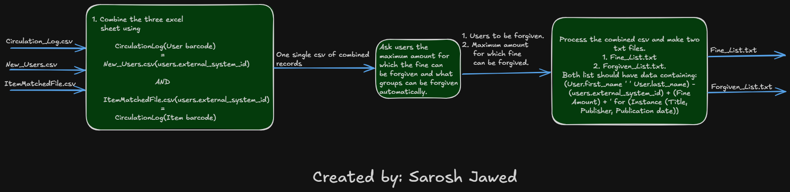

# Freyja (WinForms)

Freyja is a Windows Forms application that supports a fine-forgiveness workflow for library staff. It ingests three CSV inputs, normalizes and joins records into a combined dataset, classifies charges using configurable rules, and generates staff-ready output text files.

## Workflow


---

## Current Status (Phases 1–8)

✅ **Phase 1**: UI skeleton + predictable UX (validation, logging, tooltips)  
✅ **Phase 2**: Reliable CSV ingestion (CsvHelper) + required-header validation + sanity stats  
✅ **Phase 3**: Normalization + field extraction + structured error collection  
✅ **Phase 4**: Join normalized datasets to build `CombinedRecord` list grouped by `(UserExternalSystemId, ItemBarcode)`  
✅ **Phase 5**: Classification into **Forgiven vs Fine** using `(Amount < threshold) OR (PatronGroup selected)`  
✅ **Phase 6**: Output generation:
- `Forgiven_List.txt`
- `Fine_List.txt`
- `ErrorLog.txt`

✅ **Phase 7**: Robustness hardening:
- Header validation is **trimmed + case-insensitive**
- CSV reads support Excel-open files via **FileShare.ReadWrite**
- **Thread-safe Log()**
- **Async Run** (pipeline runs off UI thread; no UI freeze)
- UI is gated during runs

✅ **Phase 8**: Packaging + handoff:
- **Self-contained** release build (single `Freyja.exe`)
- README quickstart
- Redacted **sample-data/** for verification

---

## Quick Start (Release EXE)

1. Download the release zip and extract it.
2. Run `Freyja.exe` (Windows 10/11 x64).
   - If SmartScreen appears: **More info → Run anyway**.
3. Click **Browse…** and select the three CSV files.
   - For a quick verification, use the included `sample-data/` folder:
     - `sample-data/CirculationLog_sample.csv`
     - `sample-data/New Users_sample.csv`
     - `sample-data/ItemMatchedFiles_sample.csv`
4. Choose an **Output folder**.
5. Set the threshold (default 10.00) and optionally select patron groups.
6. Click **Run**.
7. Confirm outputs in the chosen output folder:
   - `Forgiven_List.txt`
   - `Fine_List.txt`
   - `ErrorLog.txt`

---

## What “Run” does

When you click **Run**, the pipeline executes:

1. **Phase 1 – Input validation**
   - Validates required file paths and output folder.
2. **Phase 2 – Load CSVs**
   - Reads headers and validates required columns.
   - Loads each CSV via CsvHelper and logs sanity stats (row counts, distinct keys).
3. **Phase 3 – Normalize + extract**
   - Filters invalid user barcodes (expects user barcodes starting with `E1`).
   - Parses `Description` into `FeeFineType` + `Amount`.
   - Builds lookup dictionaries:
     - users keyed by `users.external_system_id`
     - items keyed by `Barcode`
   - Collects normalization errors (MissingItem, InvalidUserBarcode, etc.).
4. **Phase 4 – Join**
   - Groups by `(UserExternalSystemId, ItemBarcode)`.
   - Each group contains a list of charges for that user+item.
5. **Phase 5 – Classify**
   - **Forgiven** if:
     - `Amount < threshold`, OR
     - the user’s `PatronGroup` is in the selected auto-forgive groups
   - **Fine** otherwise
   - A single user+item pair can generate:
     - one forgiven line-item
     - and one fine line-item (if charges split)
6. **Phase 6 – Generate outputs**
   - Writes `Forgiven_List.txt`, `Fine_List.txt`, `ErrorLog.txt`.

> Note: Missing items/users are handled at Phase 3 (errors collected and those events excluded from join).  
> That’s why Phase 4 typically reports `Missing items/users: 0`.

---

## Output Files

### `Forgiven_List.txt` and `Fine_List.txt`
One line per user+item per category. Charges are grouped by fee type so duplicates collapse:
- Example:
  - `Lost item fee & Lost item processing fee` may appear on one line with a combined total.

### `ErrorLog.txt`
Includes:
- Timestamp header
- Missing Item Barcodes (count + stable ordering)
- Invalid User Barcodes Dropped (count + stable ordering)

---

## Sample Data

The `sample-data/` folder contains a small synthetic/redacted dataset designed to exercise:
- threshold boundary behavior (10.00 routes to Fine_List)
- patron group auto-forgive
- invalid user barcode drops
- missing item barcode error logging

Do not commit real CSV files if they contain PII. Use synthetic or redacted samples only.

---

## Build from Source

Prereqs:
- Visual Studio (with Windows Desktop development)
- .NET SDK matching `TargetFramework` in `.csproj` (net10.0-windows)

Steps:
1. Open the solution in Visual Studio
2. Restore NuGet packages
3. Build and run

---

## Publish (Self-contained Single EXE)

CLI:
```powershell
dotnet publish -c Release -r win-x64 --self-contained true `
  /p:PublishSingleFile=true `
  /p:IncludeNativeLibrariesForSelfExtract=true `
  /p:EnableCompressionInSingleFile=true `
  /p:DebugType=None `
  /p:DebugSymbols=false `
  -o .\artifacts\publish\Freyja-win-x64
